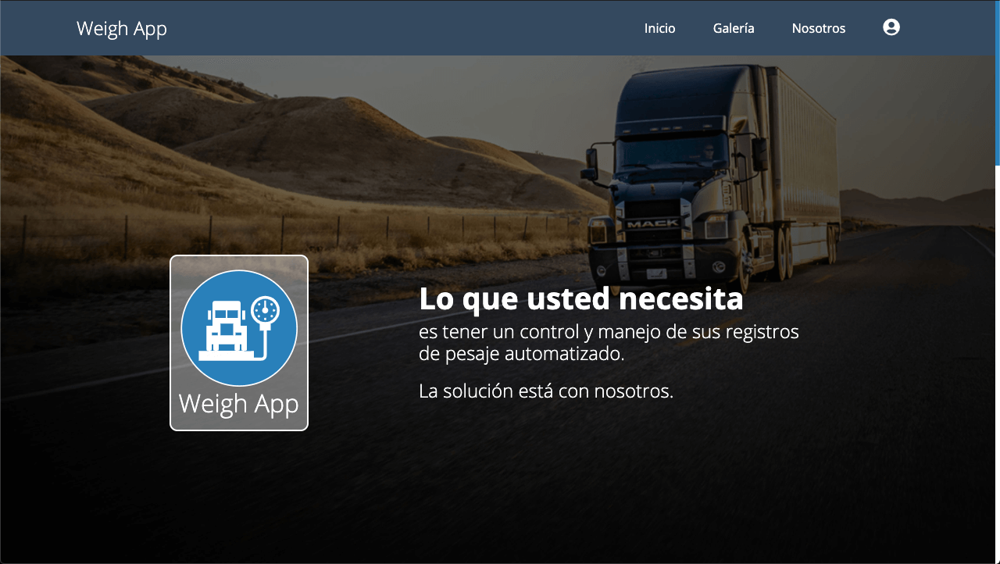

# 🚜 WeighApp - Virtual machine
 
Proyecto de báscula virtual

This project was bootstrapped with [Create React App](https://github.com/facebook/create-react-app).



## Installation

```
git clone git@github.com:donCelis/weighapp-react.git
cd weighapp-react
npm i
```

## Usage

### -Development server

```bash
npm run start
```

You can view the development server at `localhost:8080`.

### -Production build

```bash
npm run build
```

### -Deploy Github Pages

```bash
npm run deploy
```

## License

This project is open source and available under the [MIT License](LICENSE).
___
 
Copyright © 2020-present [Alexander Celis](https://github.com/donCelis) 🇨🇴